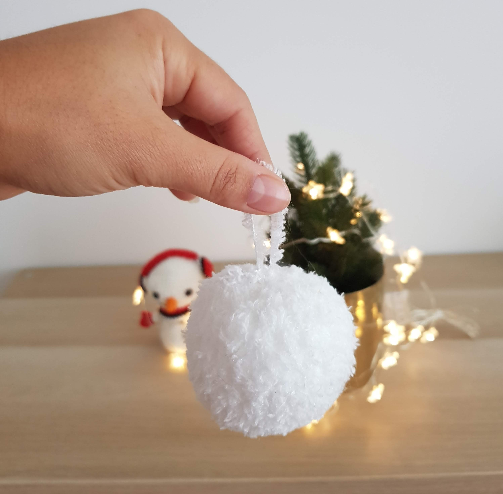

import { State, Observe } from "mdx-observable";

Are you in need of some last-minute Christmas decorations? Or looking for ornaments that will survive both kids and cats? 
These knitted snowballs are the perfect solution! They knit up quickly (well, unless you decide to make a gigantic one), and due to them being all yarn, nothing can break and no risk of dangerous glass lying around! 

This is also more of a general recipe than a pattern: you can enter your own gauge and desired size, and the pattern will automatically adjust. Isn't that neat? 

And using the snowballs as tree ornaments is only the beginning. They could also be used for indoor snowball fights - or outdoor if you live in a warmer climate. Or sew three together to make a snowman. Or make them in brighter colors for some fake ice cream toys...

## Materials

- Teddy bear or faux fur yarn - E.g. [Rico Baby Teddy Aran](https://www.lovecrafts.com/en-gb/p/rico-baby-teddy-aran)
- [DPN or circular knitting needles in a size matching your yarn](https://www.lovecrafts.com/en-gb/p/knit-pro-symfonie-interchangeable-circular-needle-deluxe-set?utm_medium=affiliate&a_aid=47afbd68)
- [Polyester filling](https://www.lovecrafts.com/en-gb/p/trimits-toy-stuffing-250g?utm_medium=affiliate&a_aid=47afbd68)
- [Tapestry needle](https://www.lovecrafts.com/en-gb/p/knit-pro-tapestry-needle-set?utm_medium=affiliate&a_aid=47afbd68)
- [Scissors](https://www.lovecrafts.com/en-gb/p/hemline-stork-scissors?utm_medium=affiliate&a_aid=47afbd68)

## Notes
- You can enter your own gauge (how many stitches you need per 4"/10cm) and how big you'd like the ball to be in the input boxes below. The number of stitches for cast on will adjust automatically. Or you can use the pre-filled defaults
- The final size of your snowball will also depend on how much you stuff it as knitted fabric is quite stretchy

## Pattern
<State initialState={{ gauge: 19, diameter: 4, co: 30  }}>
<Observe>
{({ setState, ...state }) => {
    const calcCO = (gauge, diameter) => {
        return Math.round(gauge /4 * (3.14 * diameter / 2));
    }
    return (
        <React.Fragment>
        <form>
        

            <label for="gauge">Your Gauge: </label>
             
            <input type="number" id="gauge" name="gauge"
            value={state.gauge}
            onChange={e => {
                    const newGauge = e.target.value;
                    const newCO = calcCO(newGauge, state.diameter);
                    setState({ gauge: newGauge, co: newCO});
                }}
            /> stitches / 4" (10cm)
        

        

            <label for="diameter">Snowball Diameter: </label>
             
            <input type="number" id="diameter" name="diameter"
            value={state.diameter}
            onChange={e => {
                    const newDiameter = e.target.value;
                    const newCO = calcCO(state.gauge, newDiameter);
                    setState({ diameter: newDiameter, co: newCO});
                }}
            /> inches
        

    </form>
    

    </React.Fragment>);
}}
</Observe>
<Observe>
    { ({...state}) => (
1) Cast on {state.co} sts
) }
</Observe>

</State>

2) Join for working in the round - don't worry about a gapless join, as we will close the beginning and end anyways.

3) Keep knitting in the round until the piece (laid flat) is about as high as it is wide.

4) Cut the yarn. Using the tapestry needle, thread the tail through all the loops on the needle, and pull tight. 
Use the end to form a little hoop to hang the ball. Alternatively, you can also use some other pretty 
yarn or ribbon to make the hook.

5) Using polyester filling, stuff, and shape the ball. 

6) Using the tapestry and the tail of the cast on (or a bit of scrap yarn), thread the yarn through the stitches (approx. through every 2nd stitch) and pull tight to close. 

7) Weave in all ends by pulling them through the ball with the tapestry needle and cut the yarn. 

## Abbreviations

CO - Cast on

K - Knit

sts - stitches

_This post contains affiliate links to products I recommend. If you purchase something from this page, I may receive a small percentage of the sale at no extra cost to you._
