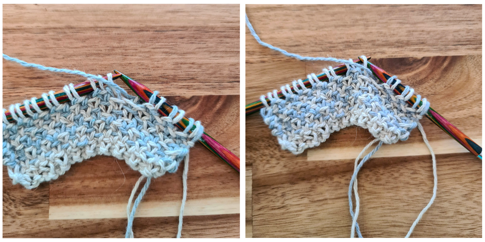

import WAKAmbassador from '../components/WAKAmbassador';

As probably most of us, I try to be environmentally conscious and recycle as much as possible - and also use products made from recycled things. This includes my crafting, and I am very excited that now more and more yarn brands offer yarns made from recycled fibers!

During a recent (online) yarn shopping, I came across 'The Recycled Yarn' from 'we are knitters', which is made from 95% recycled cotton and decided to give it a go. Because of its sturdiness, it is excellent for all things kitchen-related, such as dish towels and cloths.

Another recent find of mine is the Linen Stitch, which is a knit stitch that results in a woven-like texture. It works great for one, two or even three colors! Combine this with my need for some more dish towels in my kitchen, and tada - the Cottage Tea Towel is born!

- [Add the 'Cottage Tea Towel' pattern to your Ravelry queue here](https://www.ravelry.com/patterns/library/)
- [Get ad-free, printable PDF pattern on Etsy here](https://www.etsy.com/listing/783213806/cottage-tea-towel-knit-pattern-pdf)
- [Pin it to your Pinterest board here](https://www.pinterest.ch/pin/684617580843748110/)

## Yarn

- DK weight yarn in two colors
- Yardage: 170yds each
- I used 'The Recycled Yarn' by [we are knitters](https://www.weareknitters.com/?utm_campaign=ambassadors&utm_medium=website&utm_source=AMBASSADOR_93425) in Natural and Sky Blue

Use the code below to get 15% off from we are knitters!

<WAKAmbassador></WAKAmbassador>

## Materials

- Size 6mm (US 10) [knitting needles](https://www.lovecrafts.com/en-us/p/addi-bamboo-single-point-needles-35cm?utm_medium=affiliate&a_aid=47afbd68)
- [Tapestry needle](https://www.lovecrafts.com/en-us/p/susan-bates-steel-yarn-needles-275?utm_medium=affiliate&a_aid=47afbd68)
- [Scissors](https://www.lovecrafts.com/en-us/p/hemline-stork-scissors?utm_medium=affiliate&a_aid=47afbd68)
- [Measuring tape](https://www.lovecrafts.com/en-us/p/hemline-spring-loaded-tape-measure?utm_medium=affiliate&a_aid=47afbd68)

## Gauge

24 sts in 4" (10cm) using linen stitch

Row gauge is not critical.

## Measurements

22'' x 15'' (56cm x 38cm)

## Notes

- I highly recommend using a (non-mercerized) cotton yarn for this as cotton is sturdy, absorbent, and can also be machine-washed
- Gauge is not very critical, as it’s not a big deal if the towel is bit smaller or larger. However, I still recommend making a swatch to see if you are happy with the drape as the linen stitch tends to be tighter than other knit stitches. If it’s too loose, go down a needle size, if it’s too dense or stiff, go up a needle size
- If you want to modify the width of the towel, make sure to always cast on an odd number
- To alter the length, keep knitting until you reach the desired length
- I used a standard bind-off, and as the linen stitch results in a fairly tight fabric the bind off does not need to be very loose
- Make sure to knit the first stitch of every right-side row quite loosely, otherwise that side has a tendency to bunch up

## About the Linen Stitch

The Linen Stitch is created with a combination of knitted and slipped stitches with the yarn held in front (of the right side) to create the impression of a woven fabric.

The right side will have stitches that are kind of interlocked, with little "bars" crossing them.
The wrong side is very different but also quite pretty and looks a bit like a seed stitch. It has a bit more surface area because of the loose strings, and it's perfect for soaking up liquids.

It results in a flat fabric, and so it would also be great for coasters!

If you want to modify this pattern or create something else with the Linen Stitch, here are a couple of things to remember:

- Always cast on an odd number of stitches
- It is created by using a 2-row repeat:
  - If knitting flat:
    - \*K1, slwyif 1\* until 1 stitch before end of row, K1, turn
    - slwyib 1, \*P1, slwyib 1\* until end of row, turn
  - If knitting in the round
    - \*K1, slwyif 1\* until 1 stitch before end of round, K1
    - slwyif 1, \*K1, slwyif 1\* until end of round
- You can use as few or many colors as you wish

## How to 'Slip 1 with yarn in front / back' (slwyif / slwyib)

To slip a stitch with yarn in front, hold your working yarn (blue in the picture) in front of your work, then slip the stitch purlwise.

To slip a stitch with yarn in back, hold your working yarn behind your work, then slip the stitch purlwise.

## Pattern

Using color A: CO 91 stitches

**Row 1:** Using color A: \*K1, slwyif 1\* until 1 stitch before end of row, K1, turn

**Row 2:** Using color A: slwyib 1, \*P1, slwyib 1\* until end of row, turn

**Row 3:** Using color B: \*K1, slwyif 1\* until 1 stitch before end of row, K1, turn

**Row 4:** Using color B: slwyib 1, \*P1, slwyib 1\* until end of row, turn

Repeat rows 1-4 until the tea towel measures 22'', or you reached your desired length.

Repeat rows 1-2 once more.

Bind off using color A.

Weave in all the ends, and block.

## Abbreviations

CO - Cast on

K - Knit

P - Purl

sl - Slip a stitch, unless indicated otherwise always slip purlwise

slwyif - Slip a stitch with the yarn in front

slwyib - Slip a stitch with the yarn in back

sts - stitches

_This post contains affiliate links to products I recommend. If you purchase something from this page, I may receive a small percentage of the sale at no extra cost to you._
