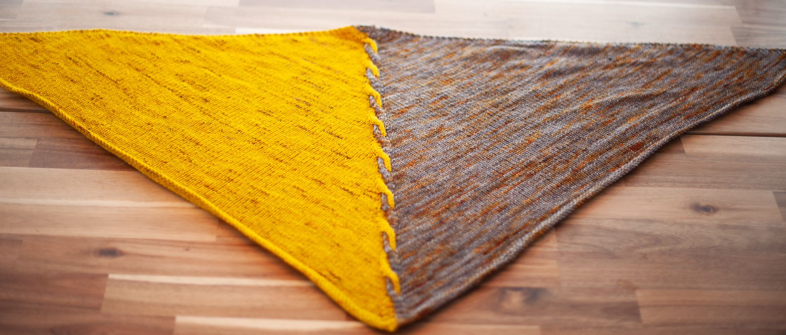
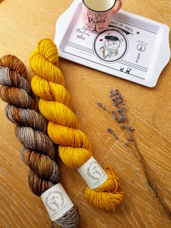
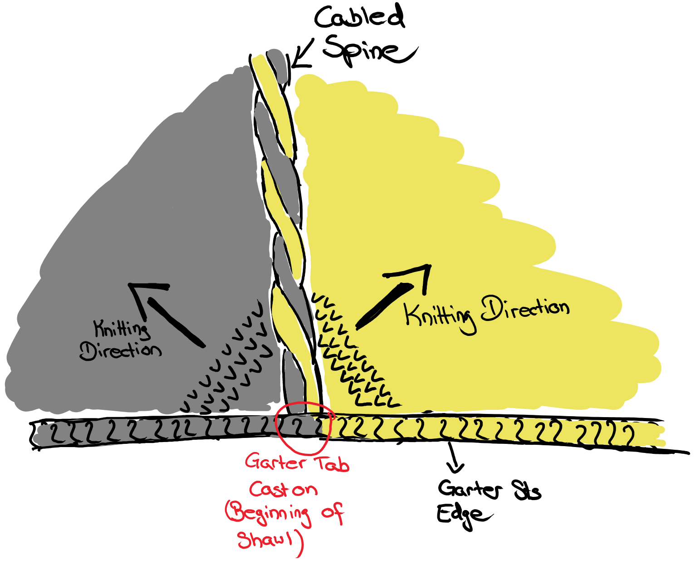
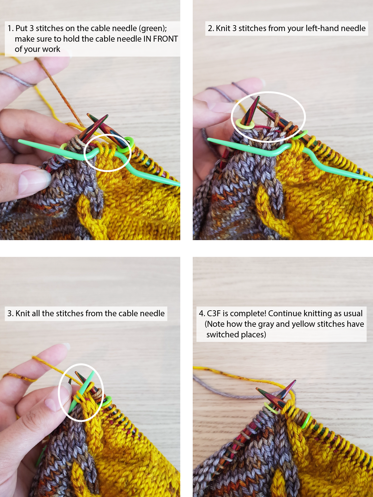
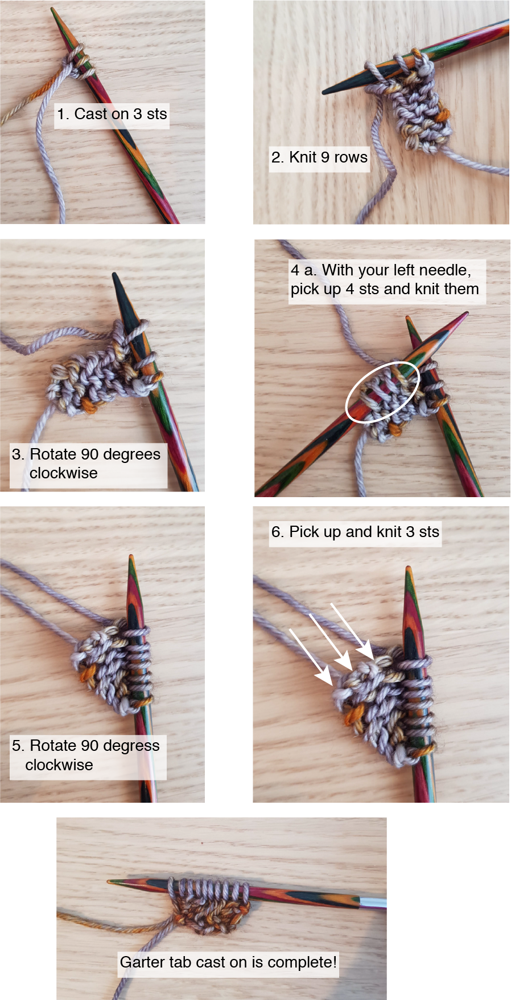

The Edge of Winter Shawl is a triangular wrap knit with two contrasting colors that are intertwined in a cable section in the middle. The yellow section represents the golden light of autumn days, and the grey slice the darker, greyer winter days. It is inspired by Harvestfest / Winternights, the Norse celebration of the end of harvest time, and the beginning of winter. It marks the turning of the year from summer to winter, the turning of our awareness from outside to inside.

The shawl uses two skeins of DK weight yarn and features beginner-friendly cabling. There is only one cable in the center, and most of the pattern is just simple stockinette with some increases. So if you have admired cables before but didn't dare, this is a fabulous first cable project!

## Materials

- 500yds / 460m DK yarn in two colors (so 250yds / 230m each)
- [Size 5mm (US 8) circular knitting needles (40-47in / 100-120cm)](https://www.lovecrafts.com/en-gb/p/knitpro-symfonie-circular-needles-120cm)
- [Cable needle](https://www.lovecrafts.com/en-gb/p/knit-pro-aluminum-cable-needles-set-of-2) (or a double-pointed needle)
- [Stitch markers](https://www.lovecrafts.com/en-gb/p/knit-pro-locking-stitch-markers?utm_medium=affiliate&a_aid=47afbd68)
- [Tapestry needle](https://www.lovecrafts.com/en-gb/p/knit-pro-tapestry-needle-set?utm_medium=affiliate&a_aid=47afbd68)
- [Scissors](https://www.lovecrafts.com/en-gb/p/hemline-stork-scissors?utm_medium=affiliate&a_aid=47afbd68)

## Gauge

17 sts and 34 rows per 4'' / 10cm in stockinette

## Finished measurements

Wingspan: 49'' / 125cm

Depth: 22'' / 56cm

## Notes

- The color switches are not explicitly stated - apart from the beginning - to make the pattern more comfortable to read. Always knit a stitch with the same color it occurs in (e.g., if you are about to knit a 'color A' stitch, use color A ). This also goes for the cabling sections
- When switching colors, bring the new color up from underneath the old one. This twists the strands together, preventing holes from forming
- The sample is knit in [La Bien Aimée's Merino DK](https://www.labienaimee.com/collections/la-bien-aimee/products/merino-dk?variant=21944855691348) in 'Yellow Brick Road Graffiti' and 'San Tokki'
- If you’d like the shawl to be larger, just keep repeating the 8 rows of the main section

## Overview

The Edge of Winter shawl is a triangular shawl that starts with a garter tab cast on.

It keeps growing by increasing around the spine (cable section) and the edges on every right-side row. The first and last three stitches are always knit on both sides to create a garter stitch edge. Every eight rows, we do a 'C3F' cable stitch in the center to create the cabled spine.

The pattern uses four stitch markers to separate the garter stitch edge and the cabled spine from the stockinette section in-between. This is also where the increases happen.

It finishes with four rows of garter stitch, and a few decreases around the center point of the triangle to make it more 'pointy'.

## How to knit the C3F cable stitch

The Edge of Winter Shawl uses a cable stitch called 'C3F' to create an intertwined appearance in the center spine. If you have never heard of this before, this section gives you an explanation of how it works, complete with step-by-step pictures. If you are familiar with cabling, feel free to skip right ahead to the pattern.

The general principle behind knitting cables is that a few stitches switch places by putting some of them 'on hold' on a separate (cable) needle. A few stitches are then knit as usual, and then the ones from the cable needle are knit, effectively passing them over the other stitches.

First, let's have a look at what 'C3F' actually stands for:

- C: 'cable' - indicates that this is a cable stitch
- 3: how many stitches should be put on the cable needle, in this case three, but this could be any number. After putting the indicated number of stitches on hold, you knit the same amount of stitches again
- F: 'front' - meaning you hold the cable needle in front of your work. The alternative is 'B' (back or behind), meaning you hold the cable behind your work

So fully written out, C3F means: you are going to do a cable stitch by slipping 3 stitches on to the cable needle, hold the cable needle in front, knit 3 stitches from your left-hand needle, knit the stitches from your cable needle.

## Pattern

### 1. Garter Tab Cast on

If this sounds daunting, worry not, there are step-by-step images below!

1.  With color A, cast on 3 sts
2.  Knit 9 rows
3.  Rotate 90 degrees clockwise
4.  Pick up 4 sts with your left needle and knit them
5.  Rotate 90 degrees clockwise
6.  Pick up and knit 3 sts

You should now have 10 sts on the needle.

Step-by-step images:

### 2. Setup

**Row 1 (WS):** K3, pm, P1, pm, P1, switch to color B, P1, pm, P1, pm, K3

**Row 2 (RS):** K3, sm, m1L, K until next marker, sm, m1R, K until next marker, m1L, sm, K until marker, m1R, sm, K3 (4 inc)

**Row 3 (WS):** K3, sm, P until last marker (slip other markers as they occur), sm, K3

**Row 4 & 5:** Repeat Rows 2 & 3 _once more_

You should now have the following on your needles:

- 3 sts - marker - 3 sts - marker - 6 sts - marker - 3 sts - marker - 3 sts (total 18 sts, one half of stitches in color A, other half in color B)

From now on, all the increases happen in the stockinette section.

**Row 6 (RS):** K3, sm, m1L, K until marker, m1R, sm, K6, sm, m1L, K until marker, m1R, sm, K3 (4 inc)

**Row 7 (WS):** K3, P until last marker (slip other markers as they occur), sm, K3

## 3. Main

**Row 1 (RS):** K3, sm, m1L, K until marker, m1R, sm, C3F, sm, m1L, K until marker, m1R, sm, K3 (4 inc)

**Row 2 (WS):** K3, P until last marker (slip other markers as they occur), sm, K3

**Row 3 (RS):** K3, sm, m1L, K until marker, m1R, sm, K6, sm, m1L, K until marker, m1R, sm, K3 (4 inc)

**Row 4 (WS):** K3, P until last marker (slip other markers as they occur), sm, K3

**Rows 5 - 8:** Repeat rows 3 & 4 _two more_ times

Repeat Rows 1-8 _fifteen more_ times, or until shawl has reached the desired length

### 4. End

**Row 1 (RS):** K3, sm, m1L, K until marker, m1R, sm, K6, sm, m1L, K until marker, m1R, sm, K3 (4 inc)

**Row 2 (WS):** K all (slip markers as they occur)

**Row 3 (RS):** K3, sm, m1L, K until marker, m1R, sm, K1, K2Tog, K2Tog, K1, sm, m1L, K until marker, m1R, sm, K3 (2 inc)

**Row 4 (WS):** K3, sm, K until marker, K1, K2Tog, K1, sm, K until marker, sm, K3 (1 dec)

Bind off.

Cut yarn and weave in ends. Block.

## Abbreviations

C3F - put 3 sts on cable needle and hold cable needle _in front of work_, K3, K3 from cable needle

CO - Cast on

inc - increased

dec - decreased

K - Knit

K2Tog - Knit 2 stitches together

m1L - Make one left (with the left needle pick up the strand between 2 stitches _from front to back_ and knit through the _back loop_)

m1R - Make one right (with the left needle pick up the strand between 2 stitches _from back to front_ and knit through the _front loop_)

pm - place marker

P - Purl

sm - Slip marker

sts - stitches

_This post contains affiliate links to products I recommend. If you purchase something from this page, I may receive a small percentage of the sale at no extra cost to you._
