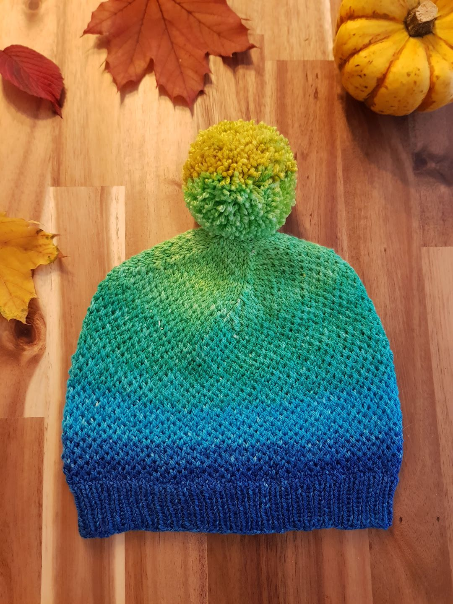
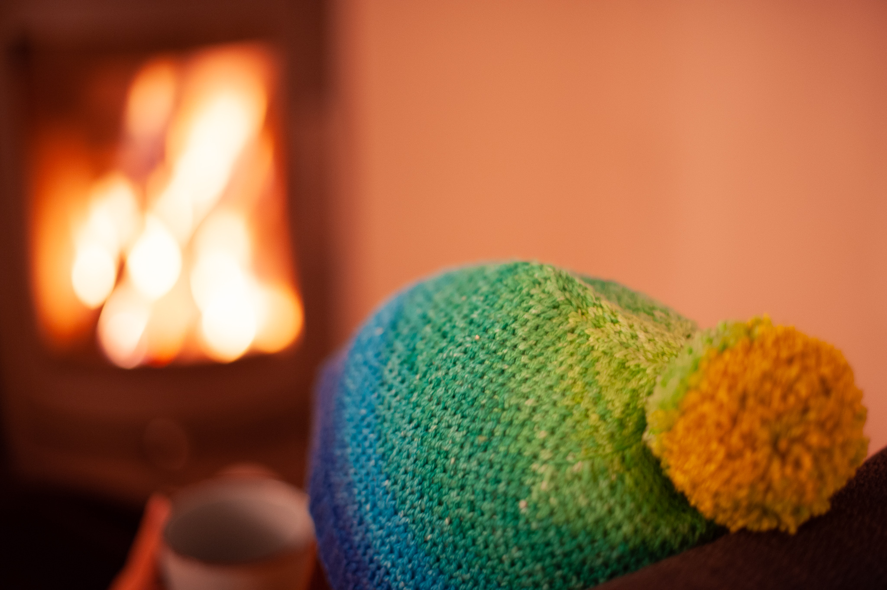
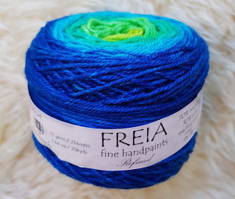
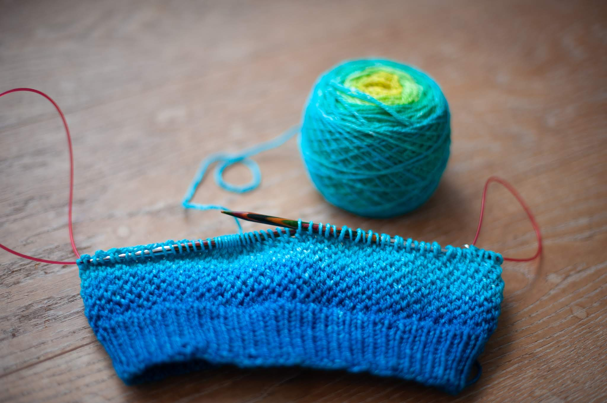
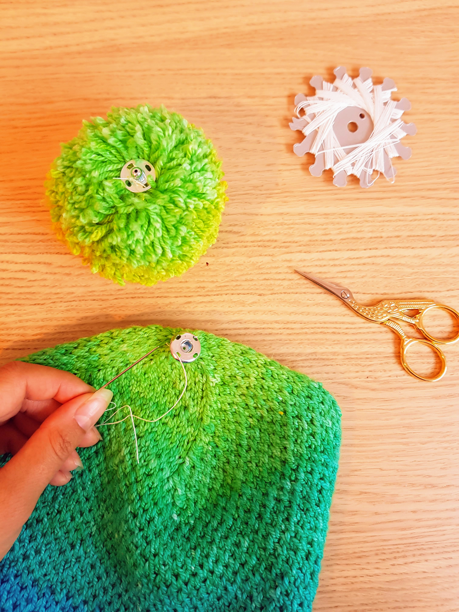
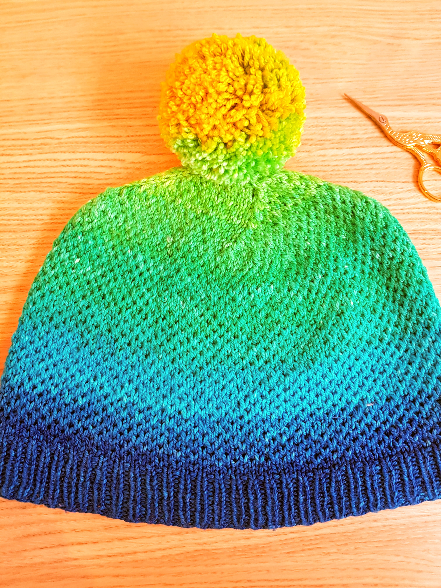

The Eye of Partridge Hat is a simple hat that is worked in the round and uses a combination of knit and slip stitches to create a beautiful texture. It uses a light-weight yarn, and it's perfect for keeping you warm during those chilly fall days.

The stitch used to create the squishy texture is called 'Eye of Partridge' and is often used to enforce the heel of a sock. I love the subtle texture it creates and wanted to show off the stitch in a different place than the heel of a sock, which sadly not many will see.

## Materials

- Size 5mm (US 8) and 4mm (US 6) knitting needles (circular or double pointed) (I am a big fan of [KnitPro Interchangeable Circular Needles](https://www.lovecrafts.com/en-gb/p/knit-pro-symfonie-interchangeable-circular-needle-starter-set?utm_medium=affiliate&a_aid=47afbd68))
- 175yds / 160m sport weight yarn
- [Stitch markers](https://www.lovecrafts.com/en-gb/p/knit-pro-locking-stitch-markers?utm_medium=affiliate&a_aid=47afbd68)
- [Tapestry needle](https://www.lovecrafts.com/en-gb/p/knit-pro-tapestry-needle-set?utm_medium=affiliate&a_aid=47afbd68)
- [Scissors](https://www.lovecrafts.com/en-gb/p/hemline-stork-scissors?utm_medium=affiliate&a_aid=47afbd68)
- [Measuring tape](https://www.lovecrafts.com/en-gb/p/hemline-spring-loaded-tape-measure?utm_medium=affiliate&a_aid=47afbd68)
- Optional: [pom-pom maker](https://www.lovecrafts.com/en-gb/p/addi-moon-pom-pom-maker?utm_medium=affiliate&a_aid=47afbd68) or finished pom-pom

## Gauge

25 sts / 4''

## Sizes

Adult (fits head circumferences between 20 - 24'')

## Finished hat measurements

Unstretched: circumference: 19''

## Notes

- Sample is shown in ["Freia Ombré M/S Sport (Refined) Gradient", color "Aloha"](https://www.ravelry.com/yarns/library/knitwhits-freia-handpaints-freia-ombre-m-s-sport-refined---gradient). I used roughly 2/3 of a skein for the hat, so the other 1/3 is great to make a pompom!
- The hat is worked in the round. I prefer to use circular needles (usually with the magic loop technique), but the pattern also works for double pointed needles.
- The ribbed brim is about 1.5'' tall, add or subtract rounds depending on how high you would like it to be
- I find it helpful to use a stitch marker to mark the beginning of a round
- The pattern uses a stitch to decrease two stitches at once. This helps to preserve the Eye of Partridge pattern. I chose the "Sl2-K1-P2sso" to do so, but feel free to use another double decrease. [TinCanKnits has a great how-to explaining the Sl2-K1-P2sso](https://blog.tincanknits.com/2016/01/21/central-double-decrease/)
- If you'd like to adjust the number of stitches for the cast-on, make sure it's a multiple of two. For the decrease, place the four decrease points (Sl2-K1-P2sso) equidistant in the row - the exact placement doesn't matter

## Pattern

### Cast on

Using 4mm (US 6) needles:

CO 120 sts and join to work in the round.

### Brim

**Rows 1 - 12:** \*K1, P1\* around

### Main

Switch to 5mm (US 8) needles.

**Row 1:** \*K\* around

**Row 2:** \*K1, Sl1\* around

**Row 3:** \*K\* around

**Row 4:** \*Sl1, K1\* around

**Rows 5 - 64:** Repeat the above 4 row (or until hat - incl. brim - measures approx. 6'' / 15cm)

### Crown

Summary: Decrease 8sts every 2nd row

**Setup:** \*K27, Sl2-K1-P2sso, place marker\* around (112sts)

**Row 1:** \*K1, Sl1\* around

**Row 2:** \*K until 3 sts before marker, Sl2-K1-P2sso\* around (decreased 8sts)

**Row 3:** \*Sl1, K1\* around

**Row 4:** \*K until 3 sts before marker, Sl2-K1-P2sso\* around (decreased 8sts)

Repeat Rows 1 - 4 until there are 16 sts left

Cut yarn and using the darning needle, thread tail through remaining stitches.
Pull tight, make a knot and weave in ends.

Optional: Add a pom-pom: use some yarn and a pom-pom maker to create a pom-pom, or buy one. With the darning needle, sew the pom-pom to the hat. Or use a snap fastener to have a removable (or interchangeable!) pom-pom.

## Abbreviations

CO - Cast on

K - Knit

K2Tog - Knit 2 stitches together

Sl2-K1-P2sso - Slip two knitwise, knit 1, pass 2 slipped sts over

P - Purl

Rd - Round

Sl - Slip stitch (unless indicated otherwise, always slip purlwise)

sts - stitches

_This post contains affiliate links to products I recommend. If you purchase something from this page, I may receive a small percentage of the sale at no extra cost to you._
