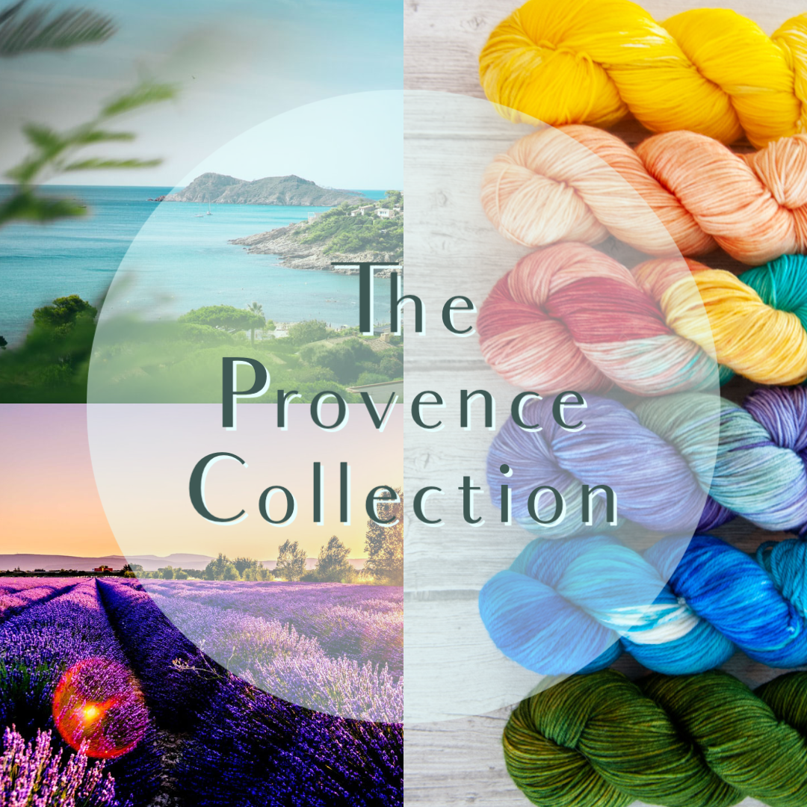
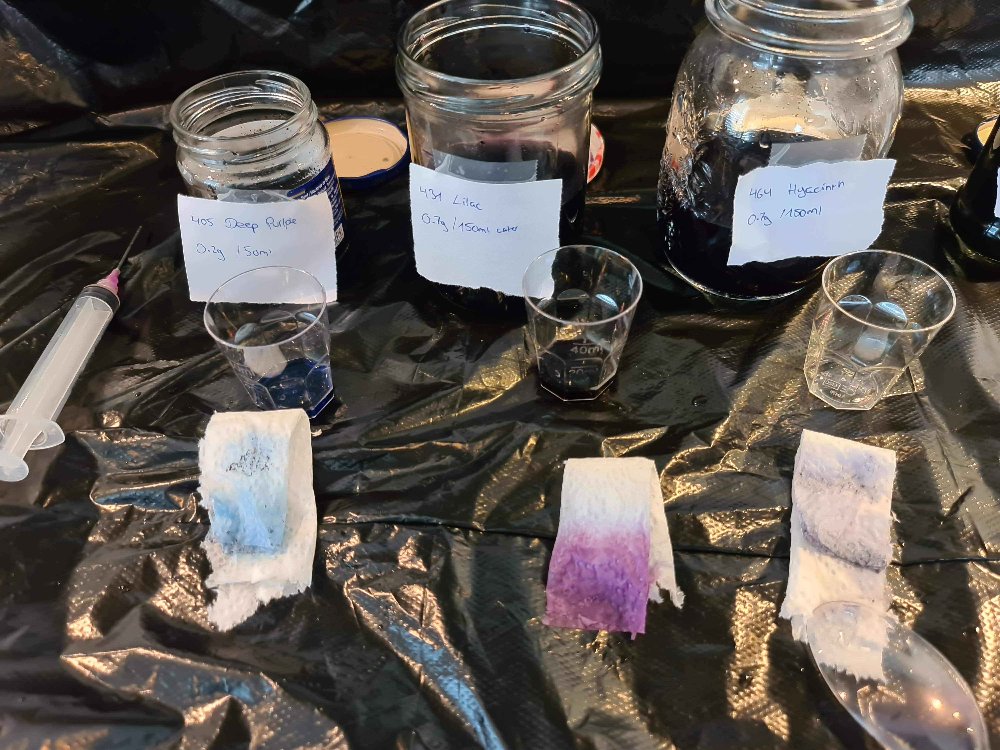
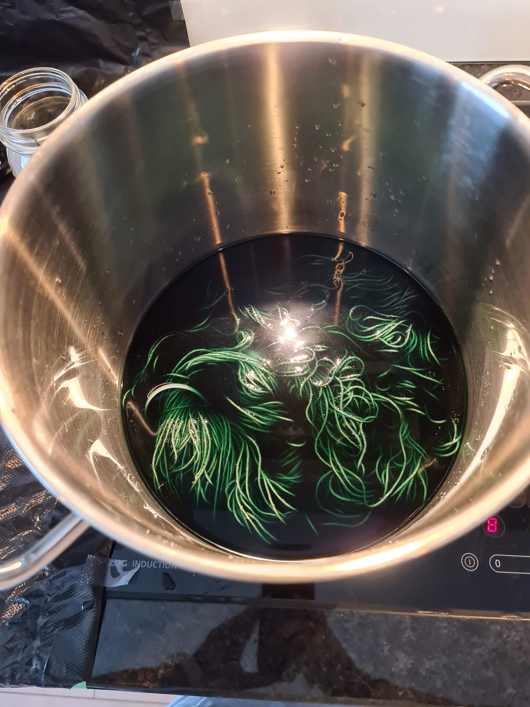
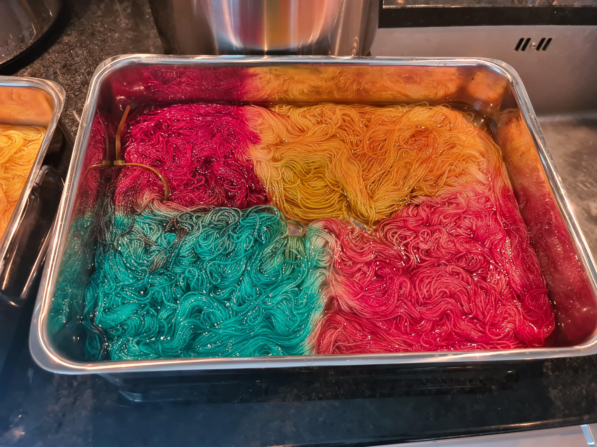

I am so happy I am finally able to share with you all what I've been working on for a long time: SkillfullyTangled now dyes yarn!

The first collection is centered around the Provence - a region in the south of France that is very near and dear to my heart. All the colors are inspired by things, places & experiences around the Provence. The iconic Lavender Fields, Sunflowers, Rosé, or the little town of Roussillon.

All the yarns are hand-dyed by myself, using Merino wool produced and spun in the UK and Italy.

I love experimenting with colors and textures, and being able to dye yarn is the perfect outlet for this. It connects my love for being exact (all the measuring, weighing, and planning) with my passion for art and creativity.

Some of the yarns I dye in a deep pot. It is fascinating to see how the water is initially deeply saturated with dye, and how after a few minutes, it is is thoroughly clear and the dye all absorbed by the yarn.

The variegated yarns - those consisting of many different, separate colors - I usually dye in a flat pan where I have the most control over where the dye goes.

Click below to shop the yarn !

  <a href="https://skillfullytangled.com/">
    Click here to shop the Provence collection
  </a>

 
