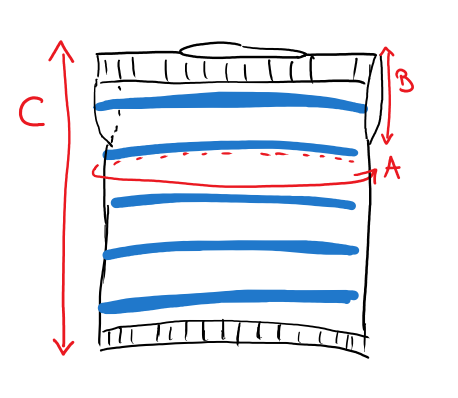
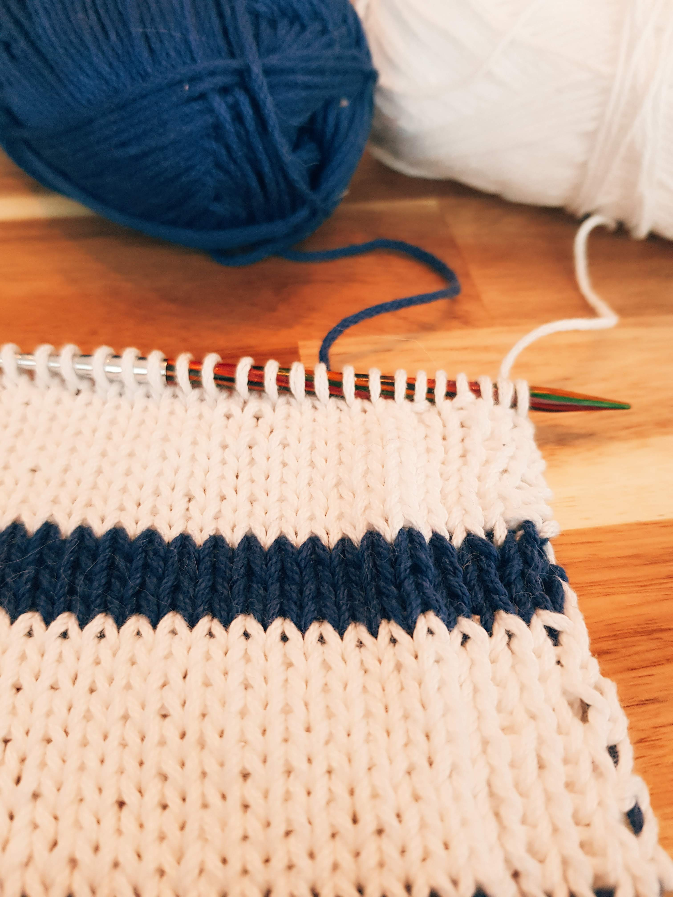
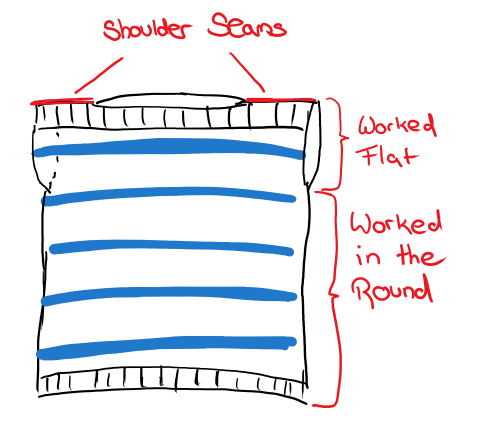
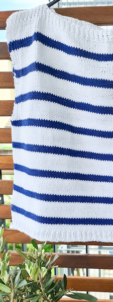

Ever since I've been a little kid, the sea has held for me a special kind of fascination - even more so because I grew up far away from it. It is the promise of adventure, what feels like unlimited space, and not knowing what one might find. So this top is a little homage to one of my favorite places, where all those adventures start (and hopefully end): the harbor.

The Harbor Top with its loose fit, cotton yarn, and sleeve-less design make it a perfect summer top that can be worn with your favorite shorts or skirt while taking a stroll around your local marina.

It is worked from the top down and features a simple construction that is beginner-friendly. It is worked flat to form the chest section and then worked in the round for the rest. Afterward, you seam a few stitches at the shoulders to finish it up.

## Yarn

- Worsted weight cotton yarn in two colors
- Required Yardage:
  - Main color: 419, (478, 532, 594, 641, _706, 767, 835, 887_) yds
  - Contrast color: 144, (165, 184, 206, 223, _247, 269, 294, 313_) yds
- Recommended: [Lion Brand 24/7 cotton](http://shrsl.com/29d4d)
- If you use Lion Brand 24/7 Cotton, you need 3, (3, 3, 3, 4, _4, 4, 5, 5_) skeins of MC and 1, (1, 1, 2, 2, _2, 2, 2, 2_) skein(s) of CC

## Materials

- Size 5mm (US 8) 32'' (or longer) [circular knitting needles](https://www.lovecrafts.com/en-us/p/knitter-s-pride-ginger-fixed-circular-needles-80cm-32in-1-pair) (or size required to achieve gauge)
- [Stitch markers](https://www.lovecrafts.com/en-us/p/knit-pro-locking-stitch-markers?utm_medium=affiliate&a_aid=47afbd68)
- [Tapestry needle](https://www.lovecrafts.com/en-us/p/susan-bates-steel-yarn-needles-275?utm_medium=affiliate&a_aid=47afbd68)
- [Scissors](https://www.lovecrafts.com/en-us/p/hemline-stork-scissors?utm_medium=affiliate&a_aid=47afbd68)
- [Measuring tape](https://www.lovecrafts.com/en-us/p/hemline-spring-loaded-tape-measure?utm_medium=affiliate&a_aid=47afbd68)
- Safety pins or removable stitch markers

## Gauge

18 sts & 26 rows in 4" (stockinette)

## Sizes

The top is intended to have a loose fit with about 6'' - 8'' of positive ease.

Whenever the pattern calls for different numbers depending on the size, they are given in the following way:
XS, (S, M, L, XL, _2XL, 3XL, 4XL, 5XL_)

| Size | Chest circumference\* | Garment Circumference (A) | Armhole diameter (B) | Total length (C) |
| ---- | --------------------- | ------------------------- | -------------------- | ---------------- |
| XS   | 28-30''               | 36.4''                    | 7''                  | 18.25''          |
| S    | 32-34''               | 40.4''                    | 7.7''                | 18.55''          |
| M    | 36-28''               | 44.4''                    | 8.3''                | 19''             |
| L    | 40-42''               | 48.4''                    | 8.9''                | 19.25''          |
| XL   | 44-46''               | 52.5''                    | 9.5''                | 19.5''           |
| 2XL  | 48-50''               | 56.4''                    | 10.1''               | 19.75''          |
| 3XL  | 52-54''               | 60.4''                    | 10.7''               | 20.25''          |
| 4XL  | 56-58''               | 64.4''                    | 11.4''               | 20.5''           |
| 5XL  | 60-62''               | 68.4''                    | 12''                 | 20.75''          |

\* based on the size charts by [Craft Yarn Council](https://www.craftyarncouncil.com/standards/woman-size)

## Notes

- The sample is shown in ["Lion Brand 27/4 Cotton", colors White and Navy](http://shrsl.com/29d4d)
- Once you have chosen your size, go through the pattern and highlight the numbers for your size, where relevant
- The length of the garment given here is more of a guideline - as our bodies and preferences differ, knit it as short or as long as you like
- You can adjust the thickness of the stripes by knitting more or less rows of the main or contrast color
- To limit the amount of ends to weave in, don’t cut the yarn when switching colors. Instead, carry it along by twisting it with the current yarn every few rows. This works for both knitting flat and in the round
- Before seaming together the shoulders, I recommend to hold the pieces together with some safety pins and try the top on to see if the width of the neck hole is what you would want it to be
- To seam together the shoulders, I used a simple whip stitch. The mattress stitch would work well, too

## Pattern

## Summary

You first knit two shoulder/chest panels flat. These are then joined to knit in the round, and you
continue knitting in the round until the piece has reached the desired length and bind off.
Lastly, you will seam a few stitches at the top of the shoulder panels together to form the shoulders and neck-hole.
To create the stripes, you knit 10 rows with the main color and 4 rows with the contrast colors.

### Chest panels (2x)

Make two.

Using 5mm (US 8) needles:

CO 82, (92, 100, 110, 118, *128, 136, 146, 154*) sts with MC

**Rows 1 - 6**: \*K1, P1\* across, turn work

**Row 7 (RS)**: \*K1, P1\* 3 times, K until 6sts before end of row, \*K1, P1\* 3 times, turn work

**Row 8 (WS)**: \*K1, P1\* 3 times, P until 6sts before end of row, \*K1, P1\* 3 times, turn work

**Rows 9 - 12**:  Repeat the rows 7 and 8 two more times

**Row 13 - 16 (4 rows)**: Using CC: repeat rows 7 and 8 twice

**Rows 17 - 26 (10 rows)**: Using MC: repeat rows 7 and 8 five times

Repeat the above stripes of 4 rows CC and 10 rows MC (rows 13 - 26) until you have a total of 47, (51, 55, 59, 63, *67, 71, 75, 79*) rows, or until panel measures 7'', (7.7'', 8.3'', 8.9'', 9.5'', *10.1'', 10.7'', 11.3'', 12’’*). Make sure to end with a RS row.
For the first panel: cut yarn, put stitches on hold on a bit of scrap yarn or a spare cable.

For the second panel: do NOT cut the yarn and keep it on your needles.

### Main body

From here on, all rows are worked in the round!

Join the two shoulder pieces to knit in the round:

- Put the first panel onto your left needle.
- Place a marker - this will mark the beginnings of your rounds
- The second panel - with the yarn still attached - should be on your right needle.
- Make sure the right side (stockinette side) is facing you

See the picture below to see what it should look like (_2nd panel on the right needle, stitch marker in between, 1st panel on the left needle with a few stitches already knit_).

Keep working in the round in stockinette (K all stitches) and continue with the stripes as above (4 rounds CC, 10 rounds MC) until work measures (from the very top) 17.25’', (17.55'', 18'', 18.25'', 18.5'', _18.75'', 19.25'', 19.5'', 19.75''_) or until 1’' short of desired length.

_Note: you might have a stripe-repeat already started in the last rows of the chest panel: e.g., if you finished the chest panel with 4 MC rows, you need to knit another 6 rounds of MC (so you have 10 rows of MC)._

## Finishing

**Rows 1-6**: \*K1, P1\* around

Bind off loosely.

At the top, where the shoulders are, seam together approx. 10 stitches on each side.

Sew in all the ends.

Wash and block.

## Abbreviations

CC - Contrast color

CO - Cast on

K - Knit

MC - Main color

P - Purl

Rd - Round

sts - stitches

_This post contains affiliate links to products I recommend. If you purchase something from this page, I may receive a small percentage of the sale at no extra cost to you._
