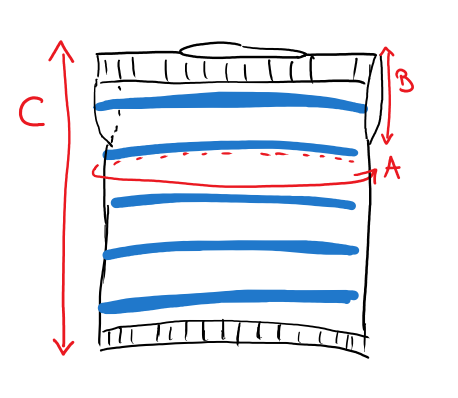
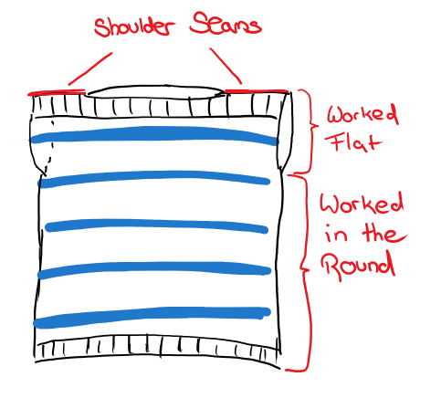

The Navy Top with its loose fit, cotton yarn and no sleeves make it a perfect summer top that can be worn over a bikini or your favorite shorts.

It is worked from the top down and features a very simple construction that is beginner-friendly. It is mostly worked in the round and only involves seaming a few stitches at the shoulders.

TODO links

- [Add pattern to your Ravelry queue here](https://www.ravelry.com/patterns/library/)
- [Get ad-free, printable PDF pattern on Etsy here](https://www.etsy.com/listing/751764354/)
- [Pin it to your Pinterest board here](https://www.pinterest.ch/pin//)

## Yarn

- Worsted weight cotton yarn in two colors
- Required Yardage:
  - Main color: 457, (515, 577, 638, 694, _757, 826, 893, 953_) yds
  - Contrast color: 51, (59, 69, 78, 86, _96, 109, 119, 130_) yds
- Recommended: [Lion Brand 24/7 cotton](https://www.lovecrafts.com/en-us/p/lion-brand-24-7-cotton?utm_medium=affiliate&a_aid=47afbd68)
- If you use Lion Brand 24/7 Cotton, you need 3, (3, 4, 4, 4, _5, 5, 5, 6_) skeins of MC and 1 skeins of CC

## Materials

- Size 5mm (US 8) circular knitting needles (or size required to achieve gauge) - I am a big fan of [KnitPro Interchangeable Circular Needles](https://www.lovecrafts.com/en-gb/p/knit-pro-symfonie-interchangeable-circular-needle-starter-set?utm_medium=affiliate&a_aid=47afbd68)
- [Stitch markers](https://www.lovecrafts.com/en-gb/p/knit-pro-locking-stitch-markers?utm_medium=affiliate&a_aid=47afbd68)
- [Tapestry needle](https://www.lovecrafts.com/en-gb/p/knit-pro-tapestry-needle-set?utm_medium=affiliate&a_aid=47afbd68)
- [Scissors](https://www.lovecrafts.com/en-gb/p/hemline-stork-scissors?utm_medium=affiliate&a_aid=47afbd68)
- [Measuring tape](https://www.lovecrafts.com/en-gb/p/hemline-spring-loaded-tape-measure?utm_medium=affiliate&a_aid=47afbd68)
- Safety pins or removable stitch markers

## Gauge

18 sts / 4" in stockinette

## Sizes

The top is intended to have a loose fit with about 6'' - 8'' of positive ease.

Whenever the pattern calls for different numbers depending on the size, they are given in the following way:
XS, (S, M, L, XL, _2XL, 3XL, 4XL, 5XL_)

| Size | Chest circumference\* | Garment Circumference (A) | Armhole diameter (B) | Total length (C) |
| ---- | --------------------- | ------------------------- | -------------------- | ---------------- |
| XS   | 28-30''               | 36.4''                    | 7''                  | 18.25''          |
| S    | 32-34''               | 40.4''                    | 7.7''                | 18.55''          |
| M    | 36-28''               | 44.4''                    | 8.3''                | 19''             |
| L    | 40-42''               | 48.4''                    | 8.9''                | 19.25''          |
| XL   | 44-46''               | 52.5''                    | 9.5''                | 19.5''           |
| 2XL  | 48-50''               | 56.4''                    | 10.1''               | 19.75''          |
| 3XL  | 52-54''               | 60.4''                    | 10.7''               | 20.25''          |
| 4XL  | 56-58''               | 64.4''                    | 11.4''               | 20.5''           |
| 5XL  | 60-62''               | 68.4''                    | 12''                 | 20.75''          |

\* based on the size charts by [Craft Yarn Council](https://www.craftyarncouncil.com/standards/woman-size)

## Notes

- The sample is shown in ["Lion Brand 27/4 Cotton", colors White and Navy](https://www.lovecrafts.com/en-us/p/lion-brand-24-7-cotton?utm_medium=affiliate&a_aid=47afbd68)
- Before seaming together the shoulders, I recommend to hold the pieces together with some safety pins and try the top on to see if the width of the neck hole is what you would want it to be
- You can adjust the thickness of the stripes by knitting more or less rows of the main or contrast color

## Pattern

## Summary

You first knit two shoulder/chest panels flat. These are then joined to knit in the round, and you
continue knitting in the round until the piece has reached the desired length and bind off.
Lastly, you will seam a few stitches at the top of the shoulder panels together to form the shoulders and neck-hole.
To create the stripes, you knit 10 rows with the main color and 4 rows with the contrast colors.

### Chest panels (2x)

Make two.

Using 5mm (US 8) needles:

CO 82, (91, 100, 109, 118, _127, 136, 145, 154_) sts with MC

**Rows 1 - 6**: \*K1, P1\* across, turn work

**Rows 7 - 12**: \*K1, P1\* 3 times, K until 6sts before end of row, \*K1, P1\* 3 times, turn work

**Rows 13 - 16** (4 rows): Using CC: \*K1, P1\* 3 times, K until 6sts before end of row, \*K1, P1\* 3 times, turn work

**Rows 17 - 26** (10 rows): Using MC: \*K1, P1\* 3 times, K until 6sts before end of row, \*K1, P1\* 3 times, turn work

Repeat the above stripes of 4 rows CC and 10 rows MC (rows 13 - 26) until you have a total of 46, (50, 54, 58, 62, _66, 70, 74, 78_) rows,
or until panel measures 7'', (7.7'', 8.3'', 8.9'', 9.5'', _10.1'', 10.7'', 11.3'', 12''_).

For the first panel: cut yarn, put stitches on hold on a bit of scrap yarn or a spare cable.

For the second panel: do NOT cut the yarn and keep it on your needles.

### Main body

From here on, all rows are worked in the round!

Join the two shoulder pieces to knit in the round:

- Put the first panel onto your left needle.
- The second panel - with the yarn still attached - should be on your right needle.

See the picture below to see what it should look like.

Keep working in the round and continue with the stripes as above (4 rounds CC, 10 rounds MC)
until work measures (from the very top)
17.25'', (17.55'', 18'', 18.25'', 18.5'', 18.75'', _19.25'', 19.5'', 19.75''_)

_Note: you might have a stripe-repeat already started in the last rows of the chest panel:
e.g., if you finished the chest panel with 4 MC rows, you need to knit another 6 rounds of MC (so you have 10 rows of MC)._

## Finishing

**Rows 1-6**: \*K1, P1\* around

Bind off loosely.

At the top, where the shoulders are, seam together approx. 10 stitches on each side.

Sew in all the ends.

Wash and block.

## Abbreviations

CC - Contrast color

CO - Cast on

K - Knit

MC - Main color

P - Purl

Rd - Round

sts - stitches

_This post contains affiliate links to products I recommend. If you purchase something from this page, I may receive a small percentage of the sale at no extra cost to you._
