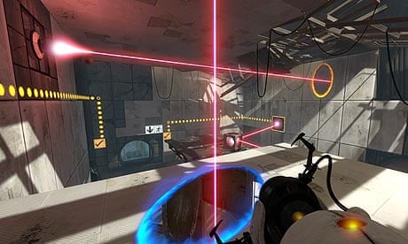
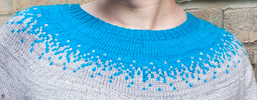
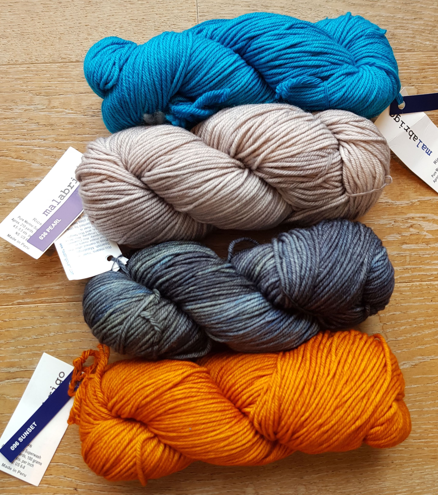
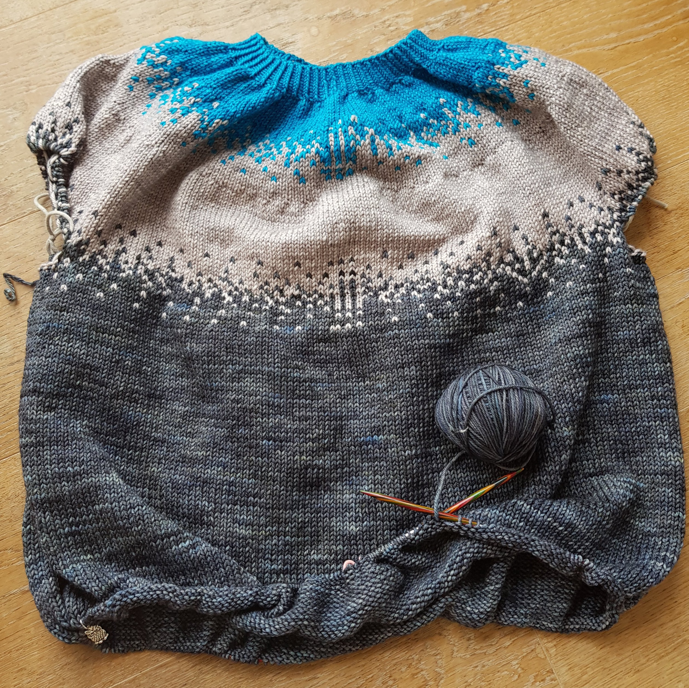
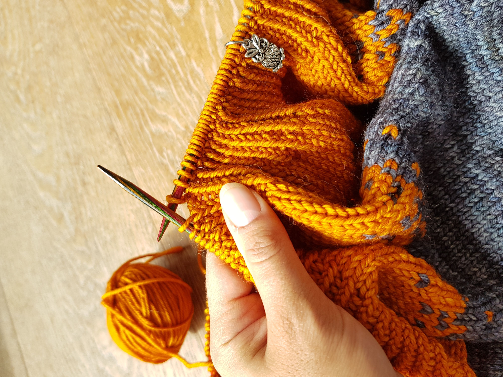
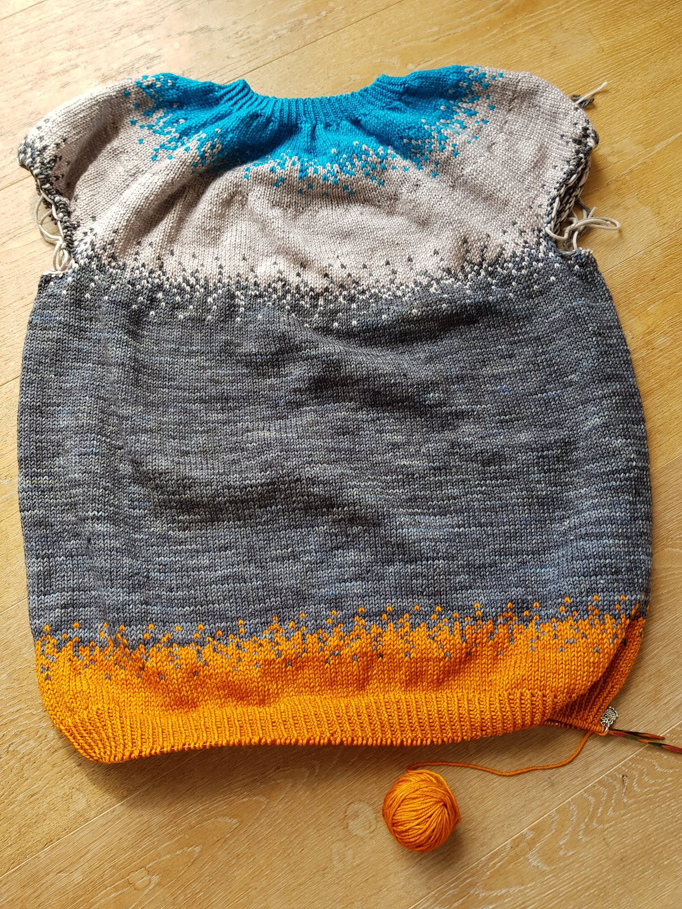
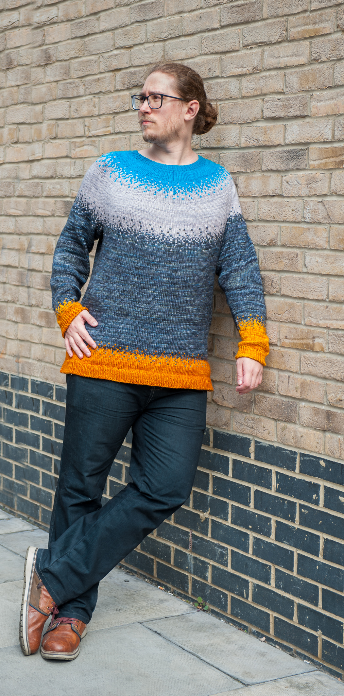

I wouldn't call myself a gamer, but over the years, there were a few computer games which I really enjoyed (and sometimes sunk a lot of time into). One of my favorite games was - and still is - Portal.
It's a puzzle game, and the premise is that you have to get out of some rooms, and the only tool you have is a portal gun. When shooting it at a surface, it creates the entrance to a portal. Shoot the gun a second time, and you have the exit. This allows you to get into places you usually couldn't, like a high up ledge. One entrance/exit of the portal is a bright electric blue, the other a deep orange.

## Context?

'Isn't this a blog about knitting and yarn?' you might be wondering. You're totally right, and this won't be a video game review.

I came across the 'Pixelated Pullover' pattern a while ago and loved the pixelated effect of the color changes. It speaks to the geek in me, and I knew I wanted to make a sweater like it one day!

After I finished my Sunrise Sweater, I immediately started planning the next sweater, and it was clear I want to use the pixelated effect. But which colors should I choose? I wanted them to echo the video game/computer theme of the pixels. This is where Portal comes in - the bright orange and electric blue would make great contrasting colors for the top and the bottom colors. For the colors between them, I chose neutral shades of grey (only two, not fifty). The two greys mainly needed to have a high enough contrast, so the pixelated effect would be clearly visible.

Now the concept of the Pixelated Portals sweater was born.

Scroll to the bottom of the post to see a picture of the finished sweater!

## Pattern

The sweater uses an amalgamation of two patterns: for the numbers and construction, I used the ['Strange Brew'](https://www.ravelry.com/patterns/library/strange-brew) recipe by TinCanKnits, and for the pixelated effect of the color changes, the ['Pixelated Pullover'](https://www.ravelry.com/patterns/library/pixelated-pullover) by Jennifer Beaumont.

## Yarn

I used [Malabrigo Rios](https://www.lovecrafts.com/en-gb/p/malabrigo-rios?utm_medium=affiliate&a_aid=47afbd68) for the Sunrise Sweater and loved it so much I wanted to use it again for this sweater. It is a superwash Merino in DK weight, and it is light enough for the finished garment to have a lovely drape and not be overly hot, but also thick enough to allow to progress fairly quickly. Also their range of gorgeous colors is just amazing!

I opted for the following colors: Cian, Pearl, Tormenta, and Sunset.

## Construction

I constructed the sweater from the top-down, meaning I started at the neck and worked my way downwards.

For all the numbers and the sweater construction, I followed the top-down instructions in Strange Brew. To do the color changes, I followed the chart in the Pixelated Pullover pattern, although I didn't always use the full chart.

The placement of color changes was mainly based on how much yarn I had of each color. In hindsight, I was always a bit too cautious and had, for example, about a third of the skein of cian left over.

## It's finished!

_This post contains affiliate links to products I recommend. If you purchase something from this page, I may receive a small percentage of the sale at no extra cost to you._
