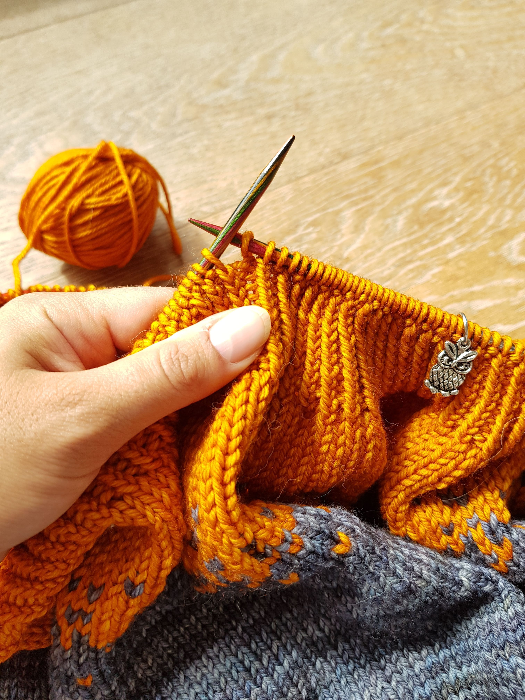
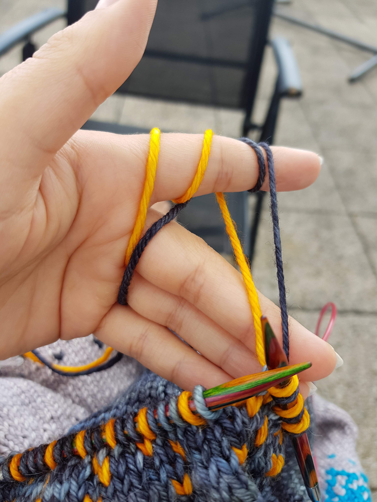

I wouldn't call myself a gamer, but over the years, there were a few computer games which I really enjoyed (and sometimes sunk a lot of time into). One of my favorite games was - and still is - Portal.
It's a puzzle game, and the premise is that you have to get out of some rooms, and the only tool you have is a portal gun. When shooting it at a surface, it creates the entrance to a portal. Shoot the gun a second time, and you have the exit. This allows you to get into places you usually couldn't, like a high up ledge. One entrance/exit of the portal is a bright electric blue, the other a deep orange.

## Context?

'Isn't this a blog about knitting and yarn?' you might be wondering. You're totally right, and this won't be a video game review.

I came across the 'Pixelated Pullover' pattern a while ago and loved the pixelated effect of the color changes. It speaks to the geek in me, and I knew I wanted to make a sweater like it one day!

After I finished my Sunrise Sweater, I immediately started planning the next sweater, and it was clear I wanted to use the pixelated effect. But which colors should I choose? I wanted them to echo the video game/computer theme of the pixels. This is where Portal comes in - the bright orange and electric blue would make great contrasting colors for the top and the bottom colors. For the colors between them, I chose neutral shades of grey (only two, not fifty). The two greys mainly needed to have a high enough contrast, so the pixelated effect would be clearly visible.

Now the concept of the Pixelated Portals sweater was born.

Scroll to the bottom of the post to see a picture of the finished sweater, or keep reading about the patterns, yarn, and construction!

## Pattern

The sweater uses an amalgamation of two patterns: for the numbers and construction, I used the ['Strange Brew'](https://www.ravelry.com/patterns/library/strange-brew) recipe by TinCanKnits, and for the pixelated effect of the color changes, the ['Pixelated Pullover'](https://www.ravelry.com/patterns/library/pixelated-pullover) by Jennifer Beaumont.

## Yarn

I used [Malabrigo Rios](https://www.lovecrafts.com/en-gb/p/malabrigo-rios?utm_medium=affiliate&a_aid=47afbd68) for the Sunrise Sweater and loved it so much I wanted to use it again for this sweater. It is a superwash merino wool in DK weight, and it is light enough for the finished garment to have a lovely drape and not be overly hot, but also thick enough to allow to progress fairly quickly. Additionally, their range of gorgeous colors is just fantastic!

I opted for the following colors: Cian, Pearl, Tormenta, and Sunset.

## Construction

I constructed the sweater from the top-down, meaning I started at the neck and worked my way downwards.

For all the numbers and the sweater construction, I followed the top-down instructions in Strange Brew. To do the color changes, I followed the chart in the Pixelated Pullover pattern, although I didn't always use the full chart.

The placement of color changes was mainly based on how much yarn I had of each color. In hindsight, I was always a bit too cautious and had, for example, about a third of the skein of cian left over.

## It's finished!

## And the future?

You might have noticed that in some pictures, the random pixels in the color change sections were not quite so random and formed neat little pillars.

This is because initially, I was planning to steek the sweater to create a cardigan. A "steek" is what a few stitches are called, which are added to a knit garment with the intent of cutting them later (_gasp_). This is, for example, common in the fair isles, where often arm- and neck holes for sweaters are created like this.

From the very beginning, I wanted the sweater to be a cardigan, but I don't like purling too much. So when I came across steeking, I thought this would be the perfect short-cut! ("short-cut" - see what I did there?) With the sweater finished and all ready to cut, I came across quite a few articles not recommending to steek superwash wool because it can be quite slippery. There are probably ways around it, but they will require a sewing machine (which I currently don't have) and some experimenting with swatches of the same wool. So for the time being, the sweater will stay a sweater. If I ever decide to embark upon the steeking journey, I will keep you updated!

## Stranded Colorwork

In the pixelated color-changing sections, I worked with two strands of yarn in different colors at the same time, which is called stranded colorwork. There are quite a few different ways how to hold the yarn: some like to have one on each hand; others have them on the same hand but different fingers. After some trial and error, I found for me it works best if I hold both yarns with my left hand (I knit continental) and wrap them around the same finger, albeit in different directions.

See the picture below for a close-up of my style. What is your preferred way of holding multiple strands of yarn? Let me know in the comment section below!

_This post contains affiliate links to products I recommend. If you purchase something from this page, I may receive a small percentage of the sale at no extra cost to you._
