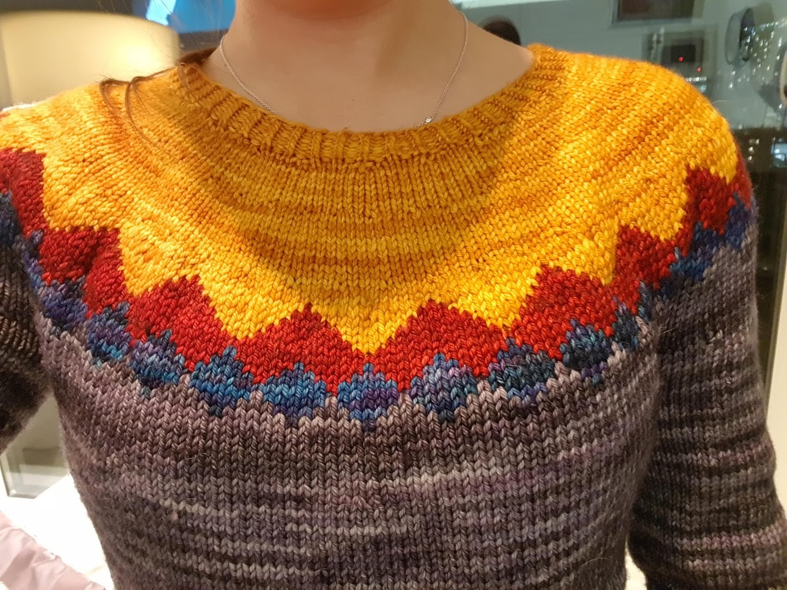
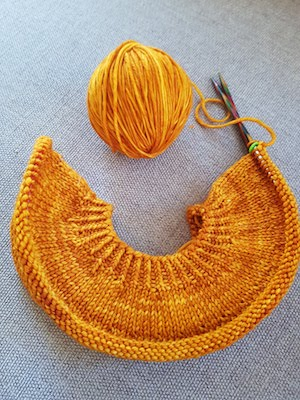
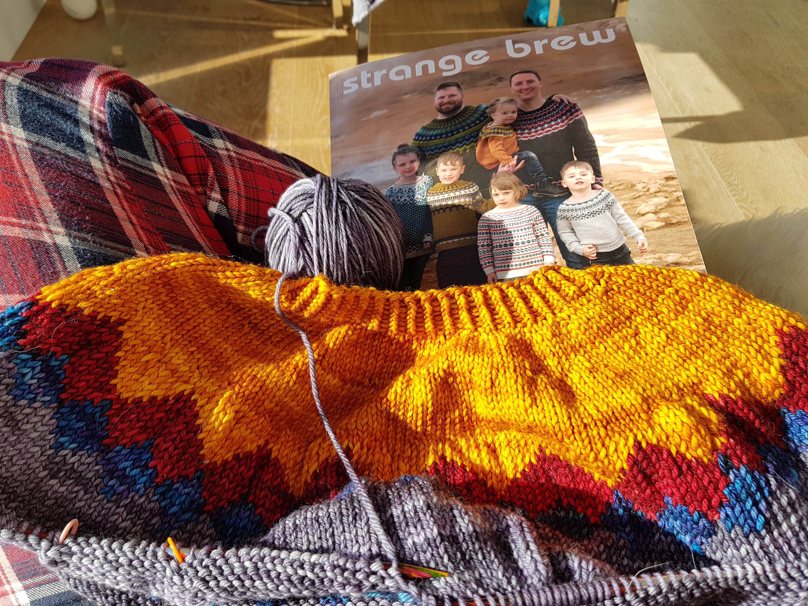
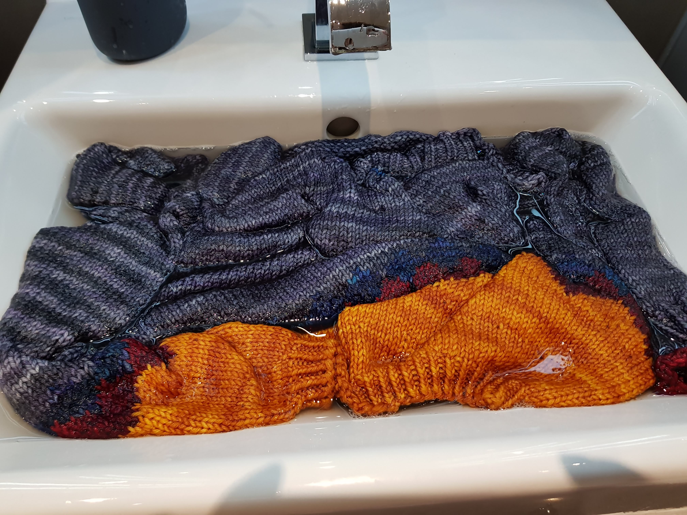
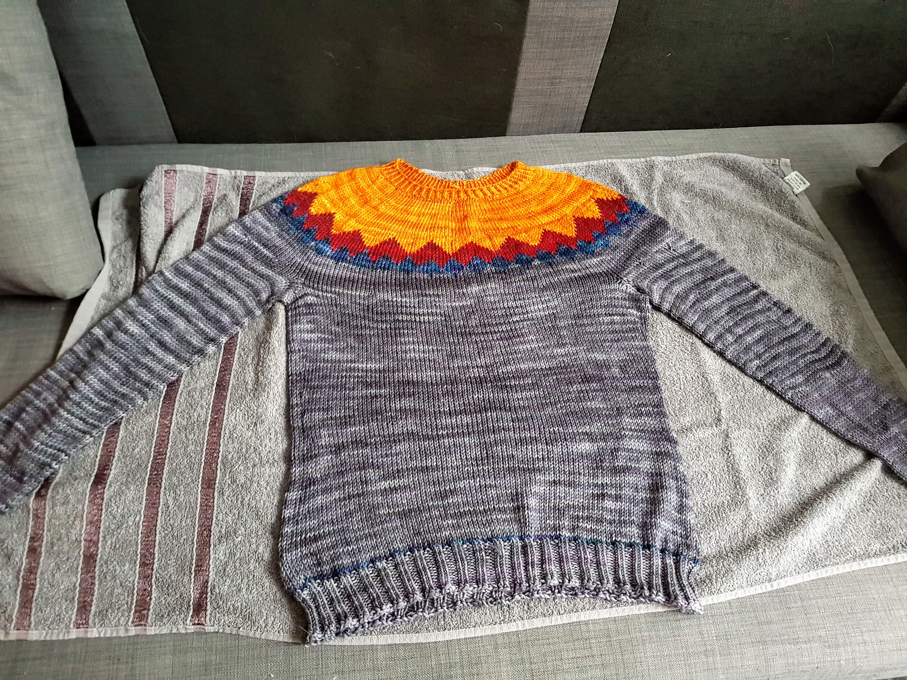
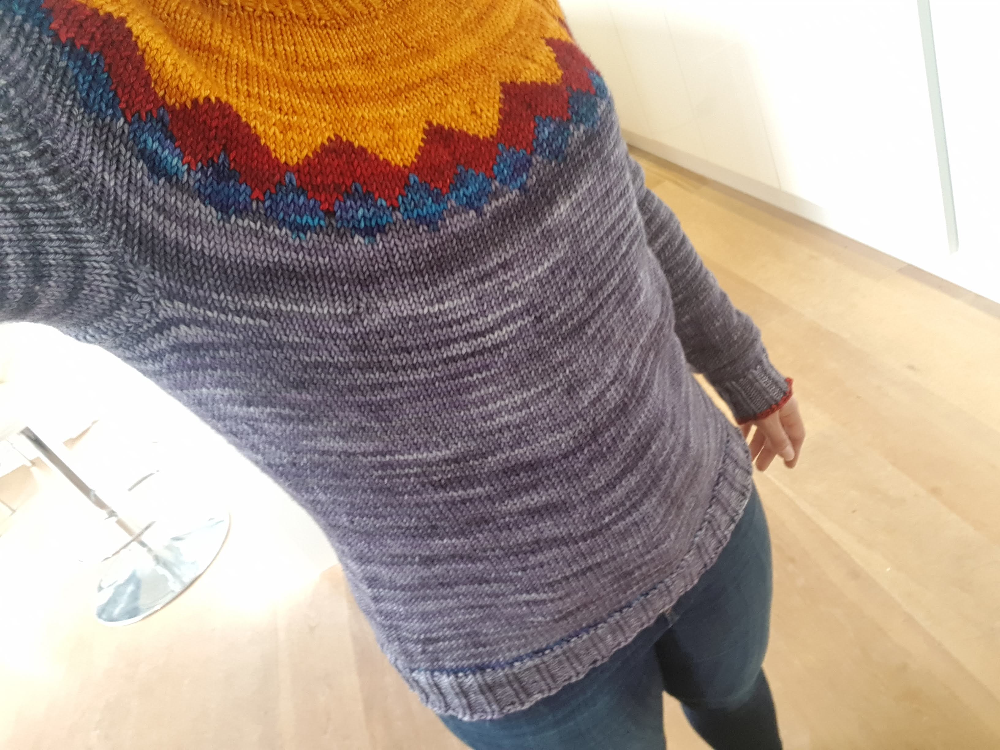

The first two sweater I've knit where classical beginner patterns: knit a few squares and seam them together. There are only quite simple techniques involved so as to make them less daunting. However, they also involve one thing I am absolutely horrible at and don't like at all: seaming. After having done it a few times now the seams look acceptable, but still not as nice as if I would have knit in the around.

After some sweaters came my first cardigan: Harvest by TinCanKnits. Hurray, no seaming! What I didn't consider though was how much purling is involved in a carding (yes, roughly 50 percent). So this motivated me to try my first "classic" sweater.

## It's a Strange Brew

It was probably around the time I was finishing my Harvest cardigan that TinCanKnits announced their sweater book "Strange Brew" for pre-order. A book containing generic sweater top-down and bottom-up instructions, with three gauges and sizes ranging from toddler to men's 4XL, many concrete patterns and beautiful pictures? Why yes, sign me up!

Once I received the book came the next question - which sweater do I knit? One of the many patterns already in the book? Or come up with my own yoke design?

Three pattens caught my eye from the beginning: Moraine, Icefall and Mountain Mist. I have always loved the classical fair isle snowflake pattern which Moraine uses for the yoke, but the all-over color work felt a bit daunting as my knitting speed is considerably slower. I love both Icefall and Mountain Mist because there's relatively little color work, and the designs feel quite sleek and modern.

I decided on Icefall because I liked how the contrast color on the dark background reminds me of stained-glass windows.

## Choosing the yarn

After comparing lots of yarn online, I went with Malabrigo Rios in superwash Merino DK. It's very high-quality wool that is not scratchy at all, and they have an amazingly big range of colors. And most yarns are tonal, meaning one skein includes many shades of the same color.

I chose Winter Road as main color, and Whales Road, Cereza and Sunset as contrast colors.

## Some things are not adding up

The pattern was chosen, the yarn has arrived, and I was ready to set out on this adventure. I was swatching to determine the gauge when I noticed that the Icefall pattern is actually written for sock weight yarn, but I've ordered DK. Of course, Strange Brew includes numbers for aran, DK and sock weight, so this shouldn't be a problem? Not by itself, but using the same pattern with a large gauge would result in the colorwork being much larger than intended. It was at about this point that I noticed that the pattern recommends having either one or four contrast colors. I ordered three contrast colors. I tried to make it all fit, but it just didn't feel _right_. More like trying to fit a square peg into a round hole.

I looked at Mountain Mist again, and while the colors in the book are all more muted and misty, I actually quite liked it for the colors I had chosen.

## Lets knit!

Now with the pattern decided and yarn all ready, it's time to cast on!

Initial progress on the yoke was quite quick, and even the colorwork went surprisingly fast. Mainly because there's not that many rows of actual colorwork (I counted, it's twelve).

The body then involved lots of single color in the round, perfect for mindless Netflix + knit. In my case, a lot of hours of true crime podcasts were involved as well.

## Wrapping it up

After all the all the ends were woven it, it is time to wash and block the sweater. I hand-washed it in cold water, using a "delicate wash" laundry detergent.

I didn't have blocking mats yet, so I used the rarely used couch in our study with a towel underneath. After the upside has reasonably dried, I flipped the sweater around.

Finally, the sweater is all done and ready to be tried on! Yay, it fits - but a bit looser than intended. A quick google search reveals why: I never washed and blocked my gauge swatch. Turns out superwash wool tends to relax quite a bit after washing. So my learning for next time: when swatching for a garment, wash and block the swatch!

