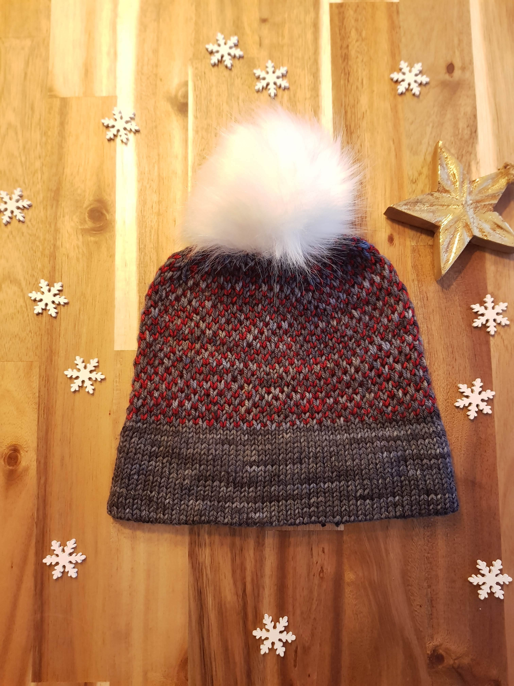

The Two Tone Toque is the big brother to my [Eye of Partridge Hat](/eye-of-partridge-hat), suitable for colder winter weather. It is worked with DK weight yarn and features a double brim for extra warmth. It uses two contrasting colors and the Eye of Partridge stitch to create an exciting texture. Each row is only ever worked with one color, so no worries about holding two yarns at once!

- [Add pattern to your Ravelry queue here](https://www.ravelry.com/patterns/library/two-tone-toque-2)
- [Get ad-free, printable PDF pattern on Etsy here](https://www.etsy.com/listing/751764354/two-tone-toque-knit-pattern-pdf)
- [Pin it to your Pinterest board here](https://www.pinterest.ch/pin/684617580840686158/)

## Yarn

- DK yarn in two colors - main color (MC): 144-160yds (130-147m), contrast color (CC): 45-50yds (40-46m)
- Recommended: [Malabrigo Rios](https://www.lovecrafts.com/en-gb/p/malabrigo-rios?utm_medium=affiliate&a_aid=47afbd68) in Tormenta (MC) and Cereza (CC)

## Materials

- Size 6mm (US 10) and 5mm (US 8) knitting needles (circular or double pointed) (I am a big fan of [KnitPro Interchangeable Circular Needles](https://www.lovecrafts.com/en-gb/p/knit-pro-symfonie-interchangeable-circular-needle-starter-set?utm_medium=affiliate&a_aid=47afbd68))
- Additonal set of needles in same or smaller size (see 'Double Brim Alternatives' section below for alternatives)
- Crochet hook (for provisional cast on, see 'Double Brim Alternatives' section below for alternatives)
- [Stitch markers](https://www.lovecrafts.com/en-gb/p/knit-pro-locking-stitch-markers?utm_medium=affiliate&a_aid=47afbd68)
- [Tapestry needle](https://www.lovecrafts.com/en-gb/p/knit-pro-tapestry-needle-set?utm_medium=affiliate&a_aid=47afbd68)
- [Scissors](https://www.lovecrafts.com/en-gb/p/hemline-stork-scissors?utm_medium=affiliate&a_aid=47afbd68)
- [Measuring tape](https://www.lovecrafts.com/en-gb/p/hemline-spring-loaded-tape-measure?utm_medium=affiliate&a_aid=47afbd68)
- Optional: [pom-pom maker](https://www.lovecrafts.com/en-gb/p/addi-moon-pom-pom-maker?utm_medium=affiliate&a_aid=47afbd68) or finished pom-pom

## Gauge

19 sts / 4" (10cm) in stockinette with smaller needles (5mm (US 8))

## Sizes

Adult Small / Adult Large

Fits head circumferences between 20-21.9" (50.8-55.6cm) / 22-24" (55.9-60.9cm)

## Finished hat measurements

Unstretched: circumference: 19.3" (49cm) / 21.2" (53.8cm)

The hat is intended to fit with about 8-12% of negative ease

## Notes

- The sample is shown in ["Malabrigo Rios", colors Tormenta and Cereza](https://www.lovecrafts.com/en-gb/p/malabrigo-rios?utm_medium=affiliate&a_aid=47afbd68)
- The hat is worked in the round. I prefer to use circular needles (usually with the magic loop technique), but the pattern also works for double-pointed needles.
- I like to use the needle and hook method for the provisional cast on: [TinCanKnits has an excellent tutorial](https://blog.tincanknits.com/2015/07/16/provisional-cast-on-needle-and-hook-method/)
- I find it helpful to use a stitch marker to mark the beginning of the round
- The pattern uses a stitch to decrease two stitches at once. This helps to preserve the Eye of Partridge pattern. I chose the "Sl2-K1-P2sso" to do so, but feel free to use another double decrease. [TinCanKnits has a great how-to explaining the Sl2-K1-P2sso](https://blog.tincanknits.com/2016/01/21/central-double-decrease/)
- If you'd like to adjust the number of stitches for the cast-on, make sure it's a multiple of two. For the decrease, place the four decrease points (Sl2-K1-P2sso) equidistant in the row - the exact placement doesn't matter
- The double brim is about 2.5" tall, add or subtract rounds depending on how high you would like it to be
- If multiple numbers are given for the different sizes, they are given in the following format: _Small (Large)_. E.g. 'CO 92 (100)' means you cast on 92 sts for the small size and 100 for the larger

### Double Brim Alternatives

I prefer to make my double brim with a provisional cast-on, so I have live stitches at the cast on edge that I can put on needles. This makes joining the beginning and end for the double brim easier.

If you don't like a provisional cast-on or don't have an additional set of needles, there are two alternatives:

1. Use a regular cast on. When knitting the beginning and end together to form the double brim, pick up the yarn through a cast on stitch and a stitch on the needle, effectively knitting them together.

2. Skip the double brim and use a ribbed brim instead: e.g. 'K1 P1' in the round until brim measures approx. 2.5" (6.5cm).

## Pattern

### Cast on

Using 5mm (US 8) needles:

Using a provisional cast-on, CO 92 (100) sts with MC and join to work in the round.

### Brim

1. K in the round until it measures approx. 5" (12.5cm)

2. Undo provisional cast on and put it on an additional circular needle or set of DPNs

   2.1. Brim laid out flat, with provisional cast on at bottom

   2.2. Unpick crochet chain one stitch at a time

   2.3. and put live stitch on the needle

   2.4. Continue the above to steps until all the stitches are on the needle

3.  Knit the two edges together to form the double brim

    3.1. Fold the knitted piece in half, with the right side on the outside. Assuming you knit with your right hand, your left hand will be holding two needles

    3.2. Knit the edges together by knitting together one stitch from the beginning and one from the end edge

    3.3. Continue kniting together one stitch from the front needle and one from the back needle until all are knitted together

### Main

Switch to 6mm (US 10) needles.

**Row 1:** With MC: \*K\* around

**Row 2:** With CC: \*K1, Sl1\* around

**Row 3:** With MC: \*K\* around

**Row 4:** With CC: \*Sl1, K1\* around

**Rows 5 and onwards:** Repeat the above 4 rows until hat - incl. brim - measures approx. 6" / 15cm (6.5" / 16.5cm)

### Crown

Summary: Decrease 8sts every 2nd row

**Setup:** With MC: \*K 20 (22), Sl2-K1-P2sso, place marker\* around (dec 8 sts)

**Row 1:** With CC: \*K1, Sl1\* around

**Row 2:** With MC: \*K until 3 sts before marker, Sl2-K1-P2sso\* around (dec 8sts)

**Row 3:** With CC: \*Sl1, K1\* around

**Row 4:** With MC: \*K until 3 sts before marker, Sl2-K1-P2sso\* around (dec 8sts)

Size Small: Repeat Rows 1 - 4 _three_ more times until there are 20 sts left. Repeat Rows 1 & 2 once more (12 sts).

Size Large: Repeat Rows 1 - 4 _four_ more times until there are 12 sts left.

Cut yarn and using the tapestry needle, thread tail through remaining stitches.
Pull tight, make a knot, and weave in ends.
Block.

Optional: Add a pom-pom: use some yarn and a pom-pom maker to create a pom-pom, or buy one. With the tapestry needle, sew the pom-pom to the hat. Or use a snap fastener to have a removable (or interchangeable!) pom-pom.

## Abbreviations

CC - Contrast color

CO - Cast on

dec - decreased

DPN - Double-pointed needle

K - Knit

K2Tog - Knit 2 stitches together

MC - Main color

Sl2-K1-P2sso - Slip two knitwise, knit 1, pass 2 slipped sts over

P - Purl

Rd - Round

Sl - Slip stitch (unless indicated otherwise, always slip purlwise)

sts - stitches

_This post contains affiliate links to products I recommend. If you purchase something from this page, I may receive a small percentage of the sale at no extra cost to you._
